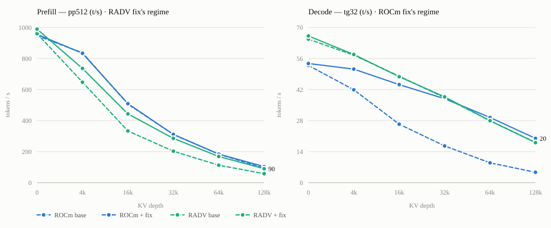

# Strix Halo (gfx1151) — quantized-KV flash-attention fixes for both backends

This branch carries two independent fixes that happen to be the same idea on two backends:
**dequantize quantized KV once, then reuse it**, instead of re-dequantizing it per consumer.

## Gain over the unpatched default

gfx1151 · Qwen3-Coder-30B-A3B · q8_0 KV. Each fix owns one half of a long-context session, and both gains
grow with depth because the redundant work each removes scales with the KV cache:

| vs default | 16k | 32k | 64k | 128k |
| ---------- | --- | --- | --- | ---- |
| **Token generation** (decode) — ROCm fix | +68% | +129% | +229% | **+327%** |
| **Prefill** — RADV fix | +33% | +41% | +50% | **+56%** |

(Token-gen figures are the ROCm backend vs its own unpatched default; prefill figures are the RADV backend
vs its own. Full per-depth tables, including the flat off-regime halves, are below. Every number traces to
the raw `llama-bench` output — error bars included — in [BENCHMARK-DATA.md](BENCHMARK-DATA.md).)

| Backend | Commit | What it fixes | Regime |
| ------- | ------ | ------------- | ------ |
| **Vulkan / RADV** | `vulkan : dequant q8_0 KV once in coopmat1` | the coopmat1 FA path dequantized q8_0 KV as a separate pass | prefill |
| **Vulkan / RADV** | `vulkan : fall back instead of aborting when FA scratch exceeds maxStorageBufferRange` | hard abort at long context | robustness |
| **HIP / ROCm** | `CUDA: dequantize KV on load in the tile FA kernel…` | the vec FA kernel re-dequantizes each KV head once per Q head (`gqa_ratio`×) | decode |
| — | `tests: cover quantized KV at head sizes 128 and 256, and gqa_ratio 8` | quantized KV had no correctness coverage above head size 72 | tests |

Upstream status: the Vulkan commits are llama.cpp PR #25494 (in review). The HIP commits are not yet
submitted — see `README.md` in this directory for the diagnosis, controls and open questions.

## The shared cause — and why it was there

Both backends were doing the same wasteful thing: **the same quantized KV, dequantized redundantly by many
parallel units.** The fix in each case is *dequantize once, then share*.

- **RADV (prefill):** the coopmat1 FA shader re-read and re-dequantized the **whole KV cache inside every
  Q-workgroup**. The fix dequantizes + transposes it **once** into an f16 scratch that all workgroups share —
  and the transpose makes the read **coalesced**, the piece whose payoff is largest on Strix's
  stride-sensitive memory (~6.9× de-coalesced read gap on the 8060S).
- **ROCm (decode):** the `vec` FA kernel processes **one Q head per block** and fuses dequant into the dot
  product, so at gqa_ratio = 8 each KV head is dequantized **8×** — once per Q head that shares it. The fix
  routes decode to the `tile` kernel, which batches the 8 heads and dequantizes into **SRAM once**.

They differ only in *which* unit was duplicating the work — Q-workgroups on RADV, Q-heads-in-a-GQA-group on
ROCm — so the two flat halves of the chart above are the proof they compose rather than overlap.

### Why the duplication was there to begin with

These were **sensible defaults, not bugs.** Fusing dequant into the compute — dequant-as-you-load — is the
simplest correct design, and it is *optimal whenever there is no reuse to capture*: f16 KV (nothing to
dequant), shallow KV (cheap to re-read), or gqa_ratio = 1 (each KV head used by a single Q head).
Materializing the dequantized KV once costs extra memory — an f16 scratch on RADV, SRAM pressure on ROCm —
that you do not want to spend in the common case.

The redundancy only dominates when three conditions coincide: **quantized KV + heavy GQA + deep context** —
i.e. large MoE models at long context, a recent workload. And on ROCm there was a hard constraint on top:
the only FA kernels that batch GQA (`tile` / `mma`) accept **f16 K/V only**, so quantized decode had nowhere
to go but `vec`. The fix — teaching `tile` to dequantize on load — is what removed that constraint. The
ROCm redundancy is plain CUDA code and architecture-independent; only its *cost*, and the RADV coalescing
benefit, are Strix-dominant.

## Each fix vs its own base, both regimes

<picture>
  <source media="(prefers-color-scheme: dark)" srcset="fa-fixes-dark.svg">
  
</picture>

All four builds are the **same commit** (upstream master) — the only difference is the patch. Colour is the
backend, dashes are the unpatched base. The two flat lines are the point: each fix moves its own regime and
provably does not touch the other's, so they compose rather than overlap.

## Measured on gfx1151 (Radeon 8060S / Ryzen AI MAX+ 395, 64 GB UMA)

Qwen3-Coder-30B-A3B-Instruct-UD-Q6_K_XL (48 layers, 32 Q heads / 4 KV heads, head_dim 128), q8_0 KV.
`llama-bench -fa 1 -b 512 -ub 512 -p 512 -n 32 -d <depth> -r 2` (128k: `-r 1 --no-warmup`), page cache
warmed, box idle, one dedicated invocation per config. **All four builds are the same commit (upstream
master); only the patch differs.** A single invocation yields both metrics, so prefill and decode below are
from the same runs. Raw output with per-arm error bars: [BENCHMARK-DATA.md](BENCHMARK-DATA.md).

### Decode — tg32 (t/s) · the ROCm fix's regime

| depth | ROCm base | ROCm + fix | Δ | RADV base | RADV + fix | Δ |
| ----- | --------- | ---------- | - | --------- | ---------- | - |
| 0    | 52.88 | **53.74** | +1.6% | 64.73 | 66.17 | +2.2% |
| 4k   | 41.88 | **51.20** | +22.3% | 57.52 | 57.80 | +0.5% |
| 16k  | 26.37 | **44.20** | +67.6% | 48.04 | 47.78 | -0.5% |
| 32k  | 16.55 | **37.86** | +128.8% | 38.32 | 38.70 | +1.0% |
| 64k  | 8.95 | **29.40** | +228.5% | 27.94 | 27.91 | -0.1% |
| 128k | 4.68 | **19.96** | +326.5% | 18.12 | 18.05 | -0.4% |

### Prefill — pp512 (t/s) · the RADV fix's regime

| depth | ROCm base | ROCm + fix | Δ | RADV base | RADV + fix | Δ |
| ----- | --------- | ---------- | - | --------- | ---------- | - |
| 0    | 947.4 | 955.6 | +0.9% | 959.8 | **989.2** | +3.1% |
| 4k   | 836.5 | 833.3 | -0.4% | 647.4 | **735.9** | +13.7% |
| 16k  | 506.3 | 508.9 | +0.5% | 333.1 | **443.0** | +33.0% |
| 32k  | 310.8 | 310.9 | +0.1% | 202.8 | **285.4** | +40.7% |
| 64k  | 183.8 | 183.8 | +0.0% | 112.3 | **168.7** | +50.2% |
| 128k | 93.21 | 103.0 | +10.5% | 57.59 | **89.79** | +55.9% |

The ROCm prefill row at 128k (+10.5%) is **noise, not a win**: every other depth is flat within ±0.9%, the
128k arm is a single shot (`-r 1`), and that arm was separately measured to swing ~±9% run to run. The ROCm
change cannot move prefill at head_dim 128 — prefill takes the `mma` path, which the patch does not touch.
Treat it as flat.

Read the Δ columns together: the ROCm fix moves decode and leaves prefill flat; the RADV fix moves prefill
and leaves decode flat. Neither is a tuning knob traded against the other — they compose.

Two things the decode table says that the headline number does not. RADV still wins shallow context, and
the crossover where ROCm overtakes it is around 32k. And the ROCm fix's value grows with depth, because the
redundant dequant it removes scales with the KV cache.

### The 64k crossover, worked

At 64k the fixes flip which backend you'd serve. Base (unpatched) versus this branch, q8_0 KV:

| 64k · q8_0 KV | prefill (pp512) | decode (tg32) |
| ------------- | --------------- | ------------- |
| ROCm base     | 183.8 | 8.95 |
| RADV base     | 112.3 | **27.9** |
| **ROCm + fix** | **183.9** | **29.4** |
| RADV + fix    | 168.7 | 27.9 |

Unpatched, 64k was split and RADV was the pick at depth: ROCm won prefill, but RADV won **decode by 3.1×**
(27.9 vs 8.95). The ROCm decode fix (8.95 → 29.4) flips that — on this branch ROCm wins **both** prefill
(+9%) and decode (+5%), so it becomes the better all-round backend at 64k. Below ~32k, RADV still leads.

## What to run on this hardware

- **Long-context decode (agentic, deep KV): ROCm + `-ctk q8_0 -ctv q8_0`** — wins past ~32k with this branch.
  Without the fix this was the worst config available; it is now competitive.
- **Shallow context: RADV + q8_0** — still ahead below ~32k.
- **Prefill-heavy ingest: RADV + q8_0** benefits from the coopmat1 dequant-once commit.
- Past ~96k context on a 64 GB box, q8_0 KV is effectively mandatory for host headroom regardless of backend.

## Verification

- `test-backend-ops -o FLASH_ATTN_EXT`: 6000/6000 against the CPU reference on the HIP backend, with the
  quantized-KV coverage this branch adds (the stock suite ran 2880 and never exercised quantized KV above
  head size 72).
- Greedy generation (temp 0) is byte-identical between the stock and patched HIP paths.
- f16 is unchanged on both backends; HIP prefill is unaffected at head_dim 64/128.

## Caveats

- **Magnitude is model-dependent — the headline is a head_dim-128 figure.** The +327% is Qwen3-Coder-30B
  (head_dim 128), where stock q8 decode is ~half of f16. On Qwen3.6-35B-A3B Q5 (head_dim 256) the same fix
  measured **+12% decode / +19% prompt processing at 32k** — milder, because the redundancy is a smaller
  share of the token budget there. It still brings q8_0 KV to f16 speed. Raw numbers in
  [BENCHMARK-DATA.md](BENCHMARK-DATA.md). The gain scales with gqa_ratio × how FA-dominated the workload is,
  not with head size.
- All numbers are gfx1151. NVIDIA is unmeasured for the HIP change; the redundancy is architecture-
  independent but its cost is not.
- The HIP dispatch prefers `tile` for symmetric q4_0/q8_0 whenever the GQA optimization applies. That
  boundary is measured on three models on one GPU, not settled.
- q4_0 reaches ~85% of its bandwidth ceiling vs q8_0's ~95%; see `README.md` for why.
- This branch is a convenience for Strix Halo users. The upstreamable units are the individual commits.
